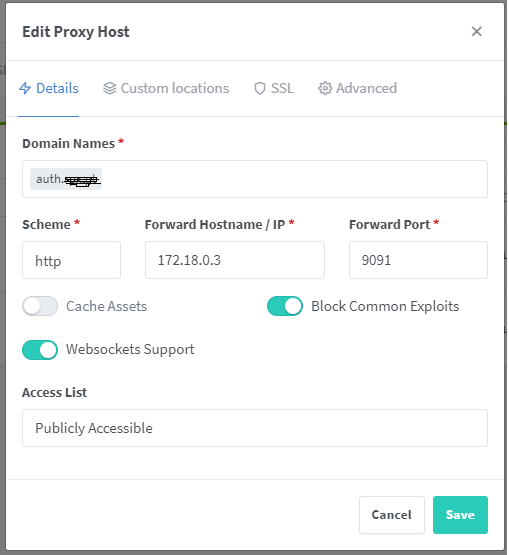
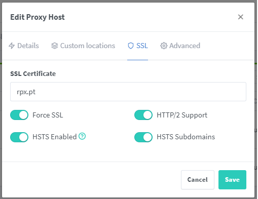

StackerHomeLab
===


## Papar Information
- Title:  `DashHomeLab With MFA`
- Authors:  `Rui Paiva`
- Preprint: [https://arxiv.org/abs/xx]()
- Full-preprint: [paper position]()
- Video: [video position]()

## Install & Dependence
- authelia
- nginx proxy manager
- other service

% gerar password para o authelia
https://bcrypt-generator.com/





Na aba Advanced do auth.domain.com, colocar:
```
location / {
set $upstream_authelia http://authelia:9091;
proxy_pass $upstream_authelia;
client_body_buffer_size 128k;

#Timeout if the real server is dead
proxy_next_upstream error timeout invalid_header http_500 http_502 http_503;

# Advanced Proxy Config
send_timeout 5m;
proxy_read_timeout 360;
proxy_send_timeout 360;
proxy_connect_timeout 360;

# Basic Proxy Config
proxy_set_header Host $host;
proxy_set_header X-Real-IP $remote_addr;
proxy_set_header X-Forwarded-For $proxy_add_x_forwarded_for;
proxy_set_header X-Forwarded-Proto $scheme;
proxy_set_header X-Forwarded-Host $http_host;
proxy_set_header X-Forwarded-Uri $request_uri;
proxy_set_header X-Forwarded-Ssl on;
proxy_redirect  http://  $scheme://;
proxy_http_version 1.1;
proxy_set_header Connection "";
proxy_cache_bypass $cookie_session;
proxy_no_cache $cookie_session;
proxy_buffers 64 256k;

}
````

No Advanced do serviço:
```
location /authelia {
    internal;
    set $upstream_authelia http://172.18.0.3:9091/api/verify; # IP e porta do Authelia
    proxy_pass_request_body off;
    proxy_pass $upstream_authelia;
    proxy_set_header Content-Length "";
    
    # Timeout se o servidor real estiver inativo
    proxy_next_upstream error timeout invalid_header http_500 http_502 http_503;
    client_body_buffer_size 128k;
    proxy_set_header Host $host;
    proxy_set_header X-Original-URL $scheme://$http_host$request_uri;
    proxy_set_header X-Real-IP $remote_addr;
    proxy_set_header X-Forwarded-For $remote_addr;
    proxy_set_header X-Forwarded-Proto $scheme;
    proxy_set_header X-Forwarded-Host $http_host;
    proxy_set_header X-Forwarded-Uri $request_uri;
    proxy_set_header X-Forwarded-Ssl on;
    proxy_redirect http:// $scheme://;
    proxy_http_version 1.1;
    proxy_set_header Connection "";
    proxy_cache_bypass $cookie_session;
    proxy_no_cache $cookie_session;
    proxy_buffers 4 32k;

    send_timeout 5m;
    proxy_read_timeout 240;
    proxy_send_timeout 240;
    proxy_connect_timeout 240;
}

location / {
    set $upstream_portainer http://192.168.10.3:80;  # IP e porta do serviço
    proxy_pass $upstream_portainer;

    auth_request /authelia;
    auth_request_set $target_url $scheme://$http_host$request_uri;
    auth_request_set $user $upstream_http_remote_user;
    auth_request_set $groups $upstream_http_remote_groups;
    proxy_set_header Remote-User $user;
    proxy_set_header Remote-Groups $groups;

    # Redirecionar para a página de login do Authelia se a autenticação falhar
    error_page 401 =302 https://auth.domain.com/?rd=$target_url;

    client_body_buffer_size 128k;
    proxy_next_upstream error timeout invalid_header http_500 http_502 http_503;
    send_timeout 5m;
    proxy_read_timeout 360;
    proxy_send_timeout 360;
    proxy_connect_timeout 360;

    proxy_set_header Host $host;
    proxy_set_header X-Real-IP $remote_addr;
    proxy_set_header X-Forwarded-For $proxy_add_x_forwarded_for;
    proxy_set_header X-Forwarded-Proto $scheme;
    proxy_set_header X-Forwarded-Host $http_host;
    proxy_set_header X-Forwarded-Uri $request_uri;
    proxy_set_header X-Forwarded-Ssl on;
    proxy_redirect http:// $scheme://;
    proxy_http_version 1.1;
    proxy_set_header Connection "";
    proxy_cache_bypass $cookie_session;
    proxy_no_cache $cookie_session;
    proxy_buffers 64 256k;
}
```


<<<<<<< HEAD
## Files Configuration
- config/users_database.yml
  ```
  users:
    mail@mail.com:
      displayname: "Your Name"
      password: "$argon2id$v=19$m=65536,t=3,p=4$seu-hash-aqui"
      email: "mail@mail.com"
      groups:
        - admins
  ```
- config/configuration.yml
  ```
  ---
  ###############################################################
  #                   Authelia configuration                    #
  ###############################################################

  server:
    address: 'tcp://:9091'

  log:
    level: 'debug'

  totp:
    issuer: '<domain>.pt'  # Nome que aparecer   no app de autentica    o
    period: 30        # Intervalo de validade do c  digo (padr  o  >
    skew: 1           # Toler  ncia de tempo (quantos per  odos ace>
    digits: 6         # N  mero de d  gitos no c  digo (padr  o    >
    algorithm: sha1   # Algoritmo usado (padr  o    SHA1)

  identity_validation:
    reset_password:
      jwt_secret: 'a_very_important_secret'

  # duo_api:
  #  hostname: api-123456789.example.com
  #  integration_key: ABCDEF
  #  # This secret can also be set using the env variables AUTHELIA>
  #  secret_key: 1234567890abcdefghifjkl

  authentication_backend:
    file:
      path: '/config/users_database.yml'

  access_control:
    default_policy: 'deny'
    rules:
      # Rules applied to everyone
      - domain: 'auth.example.com'
        policy: 'bypass'
      - domain: 'traefik.example.com'
        policy: 'one_factor'
      - domain: 'home.example.com'
        policy: 'two_factor'

  session:
    # This secret can also be set using the env variables AUTHELIA_>
    secret: 'insecure_session_secret'
    cookies:
      - name: 'authelia_session'
        domain: 'rpx.pt'  # Should match whatever your root protect>
        authelia_url: 'https://<subdomain>.<domain>.com'
        expiration: '1 hour'
        inactivity: '5 minutes'

  regulation:
    max_retries: 3
    find_time: '2 minutes'
    ban_time: '5 minutes'

  storage:
    encryption_key: 'you_must_generate_a_random_string_of_more_than>
    local:
      path: '/config/db.sqlite3'

  notifier:
    disable_startup_check: false
    #filesystem:
    #  filename: "config/notifications.log"
    smtp:
      username: 'mail@gmail.com'
    # This secret can also be set using the env variables AUTHELIA>
      password: 'pw'
      address: 'smtp-relay.brevo.com:587'
      sender: 'mail@gmail.com'
  ```


## Directory Hierarchy
```
stackerHomeLab
├── .gitignore
├── docker-compose.yml
├── Dockerfile
├── config
│    ├── configuration.yml
│    └── users_database.yml
├── homelab
│   ├── .env
└── README.md
```
=======
## Use
- config/users_database.yml
  ```
  users:
  mail@mail.com:
    displayname: "Your Name"
    password: "$argon2id$v=19$m=65536,t=3,p=4$seu-hash-aqui"
    email: "mail@mail.com"
    groups:
      - admins

  ```
- config/configuration.yml
  ```
###############################################################
#                   Authelia configuration                    #
###############################################################

server:
  address: 'tcp://:9091'

log:
  level: 'debug'

totp:
  issuer: '<domain>.pt'  # Nome que aparecer   no app de autentica    o
  period: 30        # Intervalo de validade do c  digo (padr  o  >
  skew: 1           # Toler  ncia de tempo (quantos per  odos ace>
  digits: 6         # N  mero de d  gitos no c  digo (padr  o    >
  algorithm: sha1   # Algoritmo usado (padr  o    SHA1)

identity_validation:
  reset_password:
    jwt_secret: 'a_very_important_secret'

# duo_api:
#  hostname: api-123456789.example.com
#  integration_key: ABCDEF
#  # This secret can also be set using the env variables AUTHELIA>
#  secret_key: 1234567890abcdefghifjkl

authentication_backend:
  file:
    path: '/config/users_database.yml'

access_control:
  default_policy: 'deny'
  rules:
    # Rules applied to everyone
    - domain: 'auth.example.com'
      policy: 'bypass'
    - domain: 'traefik.example.com'
      policy: 'one_factor'
    - domain: 'home.example.com'
      policy: 'two_factor'

session:
  # This secret can also be set using the env variables AUTHELIA_>
  secret: 'insecure_session_secret'
  cookies:
    - name: 'authelia_session'
      domain: 'rpx.pt'  # Should match whatever your root protect>
      authelia_url: 'https://<subdomain>.<domain>.com'
      expiration: '1 hour'
      inactivity: '5 minutes'

regulation:
  max_retries: 3
  find_time: '2 minutes'
  ban_time: '5 minutes'

storage:
  encryption_key: 'you_must_generate_a_random_string_of_more_than>
  local:
    path: '/config/db.sqlite3'

notifier:
  disable_startup_check: false
  #filesystem:
  #  filename: "config/notifications.log"
  smtp:
    username: 'mail@gmail.com'
   # This secret can also be set using the env variables AUTHELIA>
    password: 'pw'
    address: 'smtp-relay.brevo.com:587'
    sender: 'mail@gmail.com'
  ```


>>>>>>> ba8ae8b85a8d717d47d876efe859f6586801686c

## Code Details
### Tested Platform
- software
  ```
  OS: Debian 12
  ```
- hardware
  ```
  CPU: Intel Core i5
  GPU: Nvidia RTX3070
  RAM: 16GB
  ```

## License
